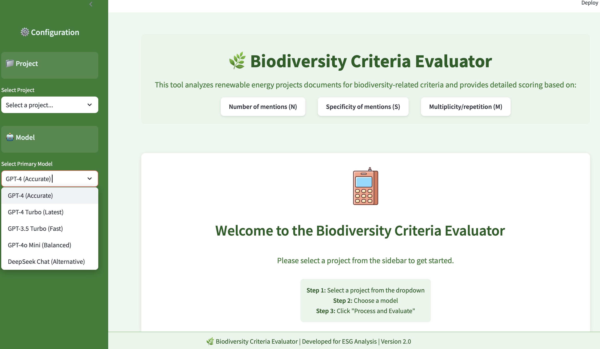

# 🌿 Biodiversity Criteria Evaluator


<p align="center">
  
</p>

A powerful RAG (Retrieval-Augmented Generation) system that analyzes project documents for biodiversity-related criteria and provides detailed scoring with interactive visualization capabilities.

## 🌟 Features

- **Document Analysis**: Process PDFs and social media data using LangChain and multiple LLM options
- **Comprehensive Scoring**: Evaluate content based on mentions (N), specificity (S), and repetition (M)
- **Interactive Chat**: Query the analyzed documents through a natural language interface
- **Dynamic Visualizations**: Generate charts automatically from document insights
- **Multiple Models**: Support for GPT-4, GPT-3.5, DeepSeek, and more
- **Social Media Integration**: Analyze social media sentiment related to projects

## 🖼️ Screenshots

<p align="center">
  
</p>

## 🔧 Installation

1. Clone the repository:

```bash
git clone https://github.com/Rosa-TH/biodiversity-criteria-evaluator.git
cd biodiversity-criteria-evaluator
```

2. Create a Python virtual environment:

```bash
python -m venv venv
source venv/bin/activate  # On Windows: venv\Scripts\activate
```

3. Install dependencies:

```bash
pip install -r requirements.txt
```

4. Create a `.env` file with your API keys:

```
OPENAI_API_KEY=your_openai_key_here
HUGGINGFACE_API_TOKEN=your_huggingface_token
```

5. Create a projects directory:

```bash
mkdir -p projects
```

## 🚀 Usage

1. Start the Streamlit application:

```bash
streamlit run app.py
```

2. Open your web browser and navigate to the provided URL (usually http://localhost:8501)

3. In the sidebar:

   - Select your project folder
   - Choose a model
   - Click "Process and Evaluate"

4. Explore results through:
   - Overview: Radar and bar charts of scores
   - Detailed Results: In-depth criteria evaluation
   - Interactive Chat: Ask questions about the documents
   - Usage Analytics: Track token usage and costs

## 📂 Project Structure

Place your project documents in individual folders under the `projects` directory:

```
projects/
  Project1/
    document1.pdf
    document2.pdf
    Picture_project1.png  # Project image (optional)
  Project2/
    ...
```

## 🔄 RAG Methodology

This tool uses a sophisticated Retrieval-Augmented Generation (RAG) approach:

1. **Document Processing**: Documents are chunked intelligently based on content type
2. **Vectorization**: Content is embedded using HuggingFace models
3. **Specialized Analysis**: Custom agents analyze biodiversity framework criteria and social media content
4. **Criteria Scoring**: Content is evaluated against predefined criteria with N, S, M metrics
5. **Interactive Query**: Natural language interface for exploring insights

## 📝 License

This project is licensed under the MIT License - see the LICENSE file for details.

## 🙏 Acknowledgements

- Icons by [Flaticon](https://www.flaticon.com/)
- Built with [Streamlit](https://streamlit.io/) and [LangChain](https://python.langchain.com/)

# Biodiversity Evaluation Metrics

This project provides a comprehensive framework for evaluating biodiversity-related content in corporate reports, social media, and other documents.

## Key Features

- **Robust Evaluation Framework**: Uses a structured framework based on multiple biodiversity categories and subcategories
- **Multi-dimensional Scoring**: Calculates scores using N (number of mentions), S (specificity), and M (multiplicity/redundancy) metrics
- **Streamlined Agent Architecture**: Focuses on core evaluation with two specialized agents:
  - **BiodiversityFrameworkAgent**: Precisely analyzes content against framework questions
  - **SocialMediaAnalysisAgent**: Provides sentiment analysis for social media content

## Recent Improvements

1. **Added BiodiversityFrameworkAgent**: A dedicated agent for analyzing content specifically against framework questions

   - Provides more accurate N, S, M metrics tailored to each question
   - Improves specificity and multiplicity calculations

2. **Streamlined Agent Architecture**:

   - Removed redundant analysis agents to focus on core functionality
   - Optimized for better performance and reduced token usage
   - Social media analysis only processed when relevant content is detected

3. **Enhanced Evaluation Pipeline**:
   - More robust and reliable analysis results
   - Better handling of content type detection
   - Improved fallback mechanisms when analysis fails

## Usage

The system evaluates documents by:

1. Loading and splitting content into manageable chunks
2. Creating vector embeddings for semantic search
3. Analyzing content against each framework question using the specialized framework agent
4. Analyzing social media content when detected
5. Calculating scores at question, subcategory and category levels
6. Generating comprehensive reports with detailed metrics

## Requirements

- Python 3.8+
- LangChain
- PyTorch
- Sentence Transformers
- FAISS vector store
- Access to language models (OpenAI GPT or DeepSeek)
